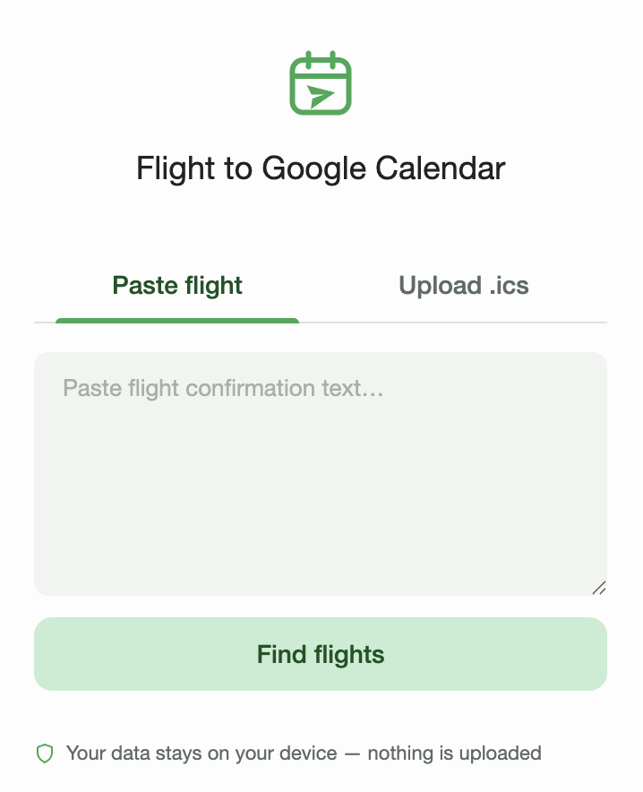

# Flight to Google Calendar

A Chrome extension. Paste your flight confirmation email into the popup, get **timezone-correct** Google Calendar events. Also takes `.ics` files.

Everything runs **locally in your browser** - no servers, no accounts, zero extension permissions. Even the AI fallback is Chrome's built-in on-device model.

## Features

- **40+ airlines** - Delta, United, American, Southwest, JetBlue, and friends ([full list](https://github.com/j-alicia-long/flight-to-gcal/wiki/Supported-airlines))
- **Airport and city names**, not just codes - `CHICAGO-OHARE`, `Heathrow`, `NYC-LaGuardia`, `Eleftherios Venizelos` all resolve via a bundled lookup (14,000+ entries)
- **Worldwide, not just US** - any of the 5,500+ shipped airports resolves when the text marks it as one (`(ATH)`, `ATH → JNX`, `07:45 ATH`), so Europe and Asia itineraries work
- **International date formats** - `09 / 11 / 2026`, `11.09.2026`, `09/11/26`; day-first vs month-first is settled by the weekday printed on the ticket
- **Timezone-correct, DST included** - departure and arrival each use their own airport's timezone (5,500+ airports)
- **On-device AI fallback** - if the regexes can't read a confirmation, Chrome's built-in Gemini Nano (Chrome 138+) takes a pass
- **Editable preview** - fix any field before adding; multi-leg trips become one event per leg
- **.ics upload mode** - drop in `.ics` files, preview, open each in Google Calendar

## Install (load unpacked)

1. Clone or download this repo
2. Open `chrome://extensions/` and turn on **Developer mode** (top-right toggle)
3. Click **Load unpacked** and pick the repo folder
4. Pin the extension and click its icon

## Privacy

- **Zero permissions** (`"permissions": []`) and **no network requests** - the airport data ships inside the extension
- The AI fallback runs **on-device** (Gemini Nano), so your text never leaves the browser
- No analytics, nothing stored - your text is parsed in the popup and discarded when it closes

## How it works

Deep dives live in the [wiki](https://github.com/j-alicia-long/flight-to-gcal/wiki):

- [How parsing works](https://github.com/j-alicia-long/flight-to-gcal/wiki/How-parsing-works) - regex first, on-device AI fallback, same deterministic pipeline either way
- [How timezone conversion works](https://github.com/j-alicia-long/flight-to-gcal/wiki/How-timezone-conversion-works) - IATA → IANA mapping, DST-safe UTC conversion via `Intl`
- [Project structure](https://github.com/j-alicia-long/flight-to-gcal/wiki/Project-structure) and [Development](https://github.com/j-alicia-long/flight-to-gcal/wiki/Development) - file layout, tests (`node test/run.js`), regenerating airport data

## Limitations

- Works best on standard US-carrier confirmation emails
- The AI fallback needs Chrome 138+ and a one-time Gemini Nano download
- Missing arrival times default to departure + 3 hours (flagged in the event description)
- No Gmail integration, on purpose - no host permissions means copy/paste is the flow
